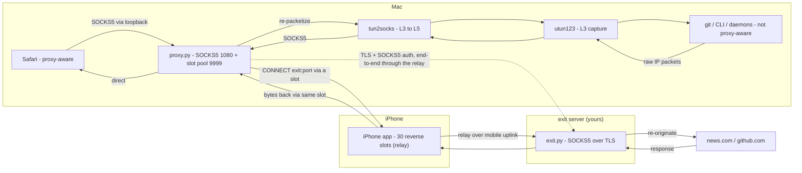

# ColdSpot — Architecture

A **system-wide transparent proxy** that routes a Mac's traffic — including apps
that have no proxy support — through a paired iPhone (acting as a relay over its
own mobile uplink) out to an **exit server you own**, by capturing traffic at the
**IP layer (Layer 3)** and tunnelling it through a **reverse connection** the
iPhone holds open.

> **15-second pitch:** A virtual network interface captures *all* of a Mac's
> traffic at Layer 3; `tun2socks` converts those packets into a SOCKS stream; a
> reverse tunnel to an iPhone carries each connection onward to a self-hosted
> exit server (authenticated SOCKS5 over TLS) that re-originates it to the
> internet. Capturing at Layer 3 means even apps that ignore proxy settings get
> caught; the iPhone is a dumb relay, so the Mac↔exit conversation is end-to-end.

---

## 1. The problem

```
GOAL: route a Mac's internet traffic out through an iPhone's cellular link,
      system-wide, including apps that know nothing about proxies.

├── Apps that support proxies (Safari)        → easy: point them at a SOCKS proxy
└── Apps that DON'T (git, CLIs, OS daemons)    → ignore proxy settings → they LEAK
        └── must be captured WITHOUT cooperation   ← the hard part
```

The two halves of the solution:

- **The tunnel** — get traffic from the Mac to the iPhone and out to the exit.
- **The capture** — force *every* app's traffic into that tunnel, even uncooperative ones.

---

## 2. High-level data flow



ASCII version (for terminals / slides):

```
        ┌─────────────────── FORWARD (app → internet) ───────────────────┐
Safari ─SOCKS(loopback)─┐
                        ├─► proxy.py ─► slot ─► en0 ─► iPhone ─uplink─► exit ─► news.com / github
git ─utun─► tun2socks ──┘     :1080      (pool)         (relay)    (TLS+SOCKS, end-to-end)
        └─────────────────── RETURN (internet → app) ───────────────────┐
news.com/github ─► exit ─► iPhone ─► slot ─► en0 ─► proxy.py ─┬─► Safari (direct)
                                                             └─► tun2socks ─► utun ─► git
```

---

## 3. Future work / improvements

- **Idle-slot reaper** — reclaim slots held by persistent idle connections
  (WebSockets, keepalives, DoH), but only under pressure (watermark-gated) to
  avoid needless reconnect churn.
- **UDP / QUIC** — the slots are TCP-only (SOCKS5 CONNECT), so UDP falls back to
  TCP; real support needs SOCKS5 UDP-ASSOCIATE or a TUN-level UDP path.
- **Adaptive pool sizing** — the pool is fixed at 30; it could shrink when idle
  and grow under sustained load.

See [ROADMAP.md](ROADMAP.md) for the fuller security roadmap (UDP path, the
WireGuard-deferred analysis, per-device credentials).
