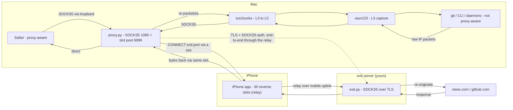

# ColdSpot — Architecture

A **system-wide transparent proxy** that routes a Mac's traffic — including apps
that have no proxy support — through a paired iPhone (acting as a relay over its
own mobile uplink) out to an **exit server you own**, by capturing traffic at the
**IP layer (Layer 3)** and tunnelling it through a **reverse connection** the
iPhone holds open.

> **15-second pitch:** A virtual network interface captures *all* of a Mac's
> traffic at Layer 3; `tun2socks` converts those packets into a SOCKS stream; a
> reverse tunnel to an iPhone carries each connection onward to a self-hosted
> exit server (authenticated SOCKS5 over TLS) that re-originates it to the
> internet. Capturing at Layer 3 means even apps that ignore proxy settings get
> caught; the iPhone is a dumb relay, so the Mac↔exit conversation is end-to-end.

---

## 1. The problem

```
GOAL: route a Mac's internet traffic out through an iPhone's cellular link,
      system-wide, including apps that know nothing about proxies.

├── Apps that support proxies (Safari)        → easy: point them at a SOCKS proxy
└── Apps that DON'T (git, CLIs, OS daemons)    → ignore proxy settings → they LEAK
        └── must be captured WITHOUT cooperation   ← the hard part
```

The two halves of the solution:

- **The tunnel** — get traffic from the Mac to the iPhone and out to cellular.
- **The capture** — force *every* app's traffic into that tunnel, even uncooperative ones.

---

## 2. High-level data flow



ASCII version (for terminals / slides):

```
        ┌─────────────────── FORWARD (app → internet) ───────────────────┐
Safari ─SOCKS(loopback)─┐
                        ├─► proxy.py ─► slot ─► en0 ─► iPhone ─uplink─► exit ─► news.com / github
git ─utun─► tun2socks ──┘     :1080      (pool)         (relay)    (TLS+SOCKS, end-to-end)
        └─────────────────── RETURN (internet → app) ───────────────────┐
news.com/github ─► exit ─► iPhone ─► slot ─► en0 ─► proxy.py ─┬─► Safari (direct)
                                                             └─► tun2socks ─► utun ─► git
```

The Mac tells the iPhone only to dial `exit:port`; it then runs TLS + authenticated
SOCKS5 to the exit **through** that slot, so the real destination is negotiated
end-to-end (Mac ↔ exit) and the iPhone never parses it.

---

## 3. Components

| Component | Runs on | Role | Layer |
|---|---|---|---|
| **exit.py** | exit server (yours) | authenticated SOCKS5-over-TLS exit; re-originates connections to the internet | L5 |
| **iPhone app** | iPhone | holds 30 "slots" open to the Mac; relays each onward to the exit over its mobile uplink (a dumb pipe) | — |
| **proxy.py** | Mac | SOCKS5 server (:1080) + slot pool (:9999) + byte/leak dashboard; speaks TLS+SOCKS to the exit through each slot | L5 |
| **tun2socks** | Mac | translates raw IP packets ⇄ SOCKS connections (two-way) | L3⇄L5 |
| **utun123** | Mac | virtual interface that captures all traffic | L3 |
| **routing table** | Mac | decides what enters utun vs stays on en0 | L3 |
| **coldspot-tun-ctl.sh** | Mac | idempotent up/down/status engine for the capture | — |
| **coldspot-watch.sh** | Mac | launchd-driven start/stop logic | — |
| **launchd (.plist)** | Mac | triggers the watcher on network change + every 30s | — |

---

## 4. The layered view (why Layer 3 matters)

```
L7 APPLICATION   git, HTTP, DNS, your data
L5 SESSION       SOCKS5  ← proxy.py speaks this (plaintext relay setup)
L4 TRANSPORT     TCP / UDP, ports (443, 1080, 9999)
L3 NETWORK       IP, routing, utun123  ← WE CAPTURE HERE
L2/L1 LINK       WiFi to the hotspot
```

> **Thesis:** The lower in the stack you intercept, the less an app can escape.
> The SOCKS5 *system setting* is Layer 5 — opt-in, so apps dodge it. The **utun
> is Layer 3** — every packet must be routed, so nothing escapes. Moving the
> capture from L5 → L3 took the leak from ~94% to ~0.2%.

---

## 5. Detailed round-trip (Safari + git, concurrently)

**Starting state:** proxy.py listening on :1080 and :9999; iPhone has 20 idle
slots open to Mac:9999; utun123 up with routes `0/1` + `128/1`; macOS SOCKS
setting ON → `127.0.0.1:1080`.

### Step 1 — two apps connect at once, via two entry paths

```
Safari → https://news.com   (OBEYS the macOS SOCKS setting)
git    → github.com:443      (IGNORES it — a leaker)
```

- **Safari (cooperative):** reads the system SOCKS setting → connects directly to
  `127.0.0.1:1080` (loopback, rides lo0, never touches utun) → speaks SOCKS5
  itself: `CONNECT news.com:443`.
- **git (captured):** opens a plain TCP connection to `github.com:443` →
  routing matches `0/1 → utun123` → utun swallows the raw packets → **tun2socks**
  rebuilds the TCP stream and speaks SOCKS5 *on git's behalf*: `CONNECT github.com:443`.

Both converge at `proxy.py:1080` speaking SOCKS5.

### Step 2 — proxy.py assigns each a slot

```
Safari → grab_slot() → slot #7   (pool: 29 left)
git    → grab_slot() → slot #8   (pool: 28 left)
proxy.py → slot#7: "CONNECT <exit-ip>:443"      ← always the exit, never the real dest
proxy.py → slot#8: "CONNECT <exit-ip>:443"
```

Slots are TCP connections the iPhone opened earlier, so writing to them sends
bytes **out en0 → 172.20.10.1 (the iPhone)** over the hotspot WiFi. Note the Mac
sends the *exit's* address to the iPhone for **every** connection — the real
destination is kept for the next step.

### Step 3 — the iPhone relays to the exit; the Mac negotiates the real dest end-to-end

```
iPhone (slot#7): reads CONNECT → opens a pipe to <exit-ip>:443 over its uplink → "CONNECTED"
iPhone (slot#8): reads CONNECT → opens a pipe to <exit-ip>:443 over its uplink → "CONNECTED"

proxy.py now talks straight THROUGH each pipe to the exit (the iPhone just shovels bytes):
   slot#7:  TLS handshake (pinned cert) → SOCKS5 user/pass auth → "CONNECT news.com:443"
   slot#8:  TLS handshake (pinned cert) → SOCKS5 user/pass auth → "CONNECT github.com:443"
exit.py dials the real destination and returns success.
```

### Step 4 — FORWARD bytes (app → internet)

`proxy.py`'s `pipe()` runs two threads per connection (one per direction):

```
Safari request → proxy.py → (TLS) slot#7 → iPhone → exit → news.com
git request    → utun → tun2socks → proxy.py → (TLS) slot#8 → iPhone → exit → github
```

### Step 5 — RETURN bytes (internet → app)

The same pipe, backwards — and the two apps **diverge again** because they entered
differently:

```
SAFARI (entered via SOCKS directly):
   news.com → exit → iPhone → slot#7 → proxy.py → writes straight back to Safari's socket ✅

GIT (entered via capture):
   github → exit → iPhone → slot#8 → proxy.py → tun2socks RE-PACKETIZES the bytes into IP
          → injects them into utun123 → OS delivers them to git as if from github ✅
```

> **Key:** `tun2socks` is a *two-way* translator — packets→stream on the way out,
> **stream→packets on the way back** — so captured apps get normal-looking responses.

---

## 6. Concurrency & the slot pool

A single web page is **dozens** of connections (HTML, CSS, JS, images), each its
own `CONNECT`, each grabbing **its own slot**:

```
20 slots = up to 20 concurrent connections at a time.
```

When a connection closes, `pipe()` closes both ends → that **slot is consumed
(one-shot, not reused)** → the iPhone must open a new slot to refill the pool.

**Known issue — slot churn (sawtooth):**
```
heavy load → many connections grab slots fast → pool drains toward 0
   → a dead slot makes proxy.py clear the WHOLE pool (too aggressive)
   → iPhone floods reconnections to refill → overshoots → "Pool full" rejects
   → sawtooth → occasional dropped connections
FIX (planned): don't clear the whole pool on one dead slot; iPhone shouldn't over-open.
```

---

## 7. Key design problems & solutions

### 7a. Why not just the SOCKS5 system setting?
Layer 5 = opt-in → git/iCloud/CLIs ignore it → ~94% leaked. **Solution:** capture
at Layer 3 (utun), where routing isn't optional → leak → ~0.2%.

### 7b. Why does the iPhone dial the Mac (reverse tunnel)?
iOS won't let an app intercept tethered-client traffic or grab packets passively.
**Solution:** the iPhone opens connections *to* the Mac (a slot pool); the Mac
pushes requests into them; the iPhone **re-originates** each over cellular, so it
exits as the iPhone's own traffic.

### 7c. The routing loop (the cleverest part)
utun sends all internet traffic to proxy.py — but proxy.py must reach the iPhone
(`172.20.10.1`). If *that* also entered utun → `proxy.py → utun → proxy.py → …`
infinite loop. **Solution: longest-prefix-match routing.**
- `172.20.10.1` is in en0's connected `/28` subnet → more specific than the `/1`
  capture routes → traffic to the iPhone goes out **en0**, not utun.
- We add `0/1` + `128/1` (cover the whole internet in two halves) to **override
  the default without deleting it** — they beat `/0` but lose to the `/28`.
  No loop, and fully reversible (delete two routes → default restored).

### 7d. DNS would silently break it
Route everything into utun → DNS (UDP) hits the TCP-only proxy → dies → nothing
resolves. **Solution:** pin the DNS resolver (`1.1.1.1`) to en0 with a host route
so lookups bypass the tunnel (KB-scale).

### 7e. Automation & the WatchPaths blind spot
launchd watches `SystemConfiguration` → fires on network change. But the iPhone
connecting its slots is just a **TCP socket**, not a config change → WatchPaths
never fires for it → utun would never come up. **Solution:** `StartInterval=30s`
reconcile — a periodic, idempotent re-check that brings utun up once slots are
ready and tears down stale routes.

### 7f. Fail-safe — never blacks out the Mac
utun up with 0 working slots → all traffic routes into a dead end → no internet.
**Solution:** the up-path is **gated** — it refuses to capture unless (proxy up
AND ≥1 slot). Teardown restores the default route instantly; leaving the hotspot
auto-tears-down.

---

## 8. Explaining it (three depths)

**30 seconds:** "A transparent system-wide proxy: a virtual interface captures all
of a Mac's traffic at the IP layer, tun2socks converts those packets into a SOCKS
stream, and a reverse tunnel to an iPhone re-originates each connection over
cellular. The trick is capturing at Layer 3 so even apps that ignore proxy
settings get caught."

**2 minutes:** walk the round-trip (Section 5) + the L3-vs-L5 thesis (Section 4).

**Deep dive:** the **routing loop + longest-prefix-match (7c)** — it shows you
understand routing internals, not just gluing tools.

---

## 9. Transferable concepts

- **TUN/TAP & userspace networking** — capturing at L3, rebuilding TCP in userspace.
- **"VPN-ify any proxy"** — `tun2socks + any SOCKS proxy` = system-wide tunnel
  (works with `ssh -D`, this proxy.py, anything).
- **Routing internals** — longest-prefix-match, non-destructive default override,
  split routes.
- **OSI layers in practice** — the interception layer decides who you can capture.
- **Reconcile loops vs event-driven** — and when events have blind spots.
- **Fail-safe design** — gating a dangerous operation, idempotency, clean teardown.

---

## 10. Components on disk

```
ios-proxy-test/
├── proxy.py                 SOCKS5 server + slot pool + leak dashboard (Mac)
├── tun2socks                L3⇄L5 translator (binary; from xjasonlyu/tun2socks)
├── coldspot-tun-ctl.sh      utun up/down/status engine (idempotent, safety-gated)
├── coldspot-tun-up/down.sh  thin wrappers around the engine
├── coldspot-watch.sh        launchd-driven start/stop on hotspot
├── com.coldspot.hotspot.plist  launchd job (WatchPaths + StartInterval=30s)
└── ProxyTest/               iPhone app (the 30-slot reverse tunnel)
```

---

## 11. Future work / improvements

### Idle-slot reaper (watermark-gated)
Persistent idle connections — WebSockets (e.g. `alive.github.com`), keepalives,
DoH (`one.one.one.one`) — hold a slot even when you're not actively using that
site. Reclaim them, but **only under pressure** to avoid needless kill/reconnect
churn:
- Track per-connection `last_activity` + `bytes` (updated in `pipe()`).
- A reaper thread: if free slots `< REAP_WATERMARK` (e.g. 5), close connections
  idle `> REAP_IDLE_SECS` (e.g. 20s), preferring `[bg]` then most-idle.
- **Safe by design:** idle != active (a connection serving a foreground task is
  transferring bytes, so it's never idle), and persistent connections
  auto-reconnect. Worst case is a sub-second reconnect on a backgrounded tab.
- When free slots are plentiful the reaper does nothing → no churn. This is why
  it's gated by a watermark rather than reaping on a fixed timeout.

### UDP / QUIC support
proxy.py + the iPhone slots are **TCP-only** (SOCKS5 CONNECT). UDP (QUIC/HTTP3)
is dropped, so apps fall back to TCP. Real UDP support needs SOCKS5
UDP-ASSOCIATE on both ends, or a TUN-level UDP path.

### Optional encrypted relay (destination privacy)
Today the iPhone re-originates directly to each destination, so the carrier sees
destination IPs/SNI (metadata, not content — that's still HTTPS). An optional
encrypted relay on the iPhone (TLS to a self-hosted server) would collapse all
traffic into one opaque flow, hiding destinations, while still exiting on the
phone bearer. Cost: extra latency + a single point of failure.

### Adaptive pool sizing
The pool is fixed at 30. It could shrink when idle (less iPhone battery/resource
use) and grow under sustained load.
